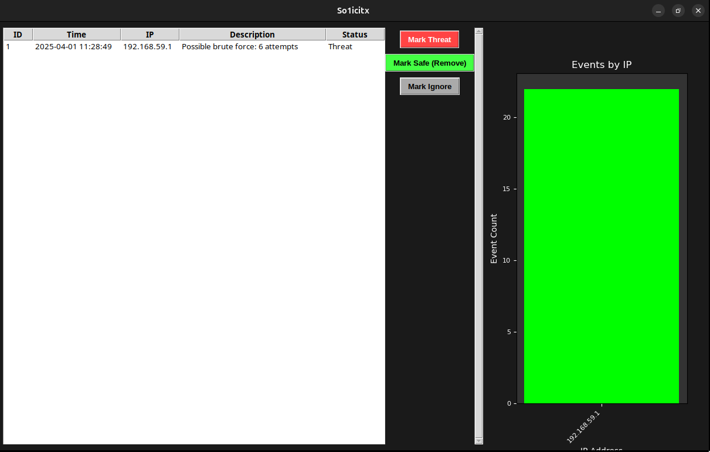

# so1icitx - A Prototype SIEM

**So1icitx** is a Security Information and Event Management (SIEM) system built as a prototype for cybersecurity experimentation and learning. Developed on an Ubuntu VM, it monitors SSH login attempts, detects brute-force attacks, and provides a graphical interface for reviewing alerts. This project is a work in progress, with plans to expand into malware detection and more advanced features in the future.

## Screenshot
  
* The so1icitx interface showing alerts and IP event graph.

## Installation
This prototype runs on an Ubuntu VM (tested with Ubuntu 24.04, Python 3.12).

### Prerequisites
- **Ubuntu VM**: Set up with SSH enabled:
  ```bash
  sudo apt install openssh-server
  ```
- **Python 3**: Comes with Ubuntu, plus required libraries:
  ```bash
  sudo apt install python3-tk -y
  sudo pip3 install matplotlib --break-system-packages
  ```

### Setup
1. **Create the Project Directory**
   ```bash
   mkdir -p [DIRECTORY]
   cd [DIRECTORY]
   ```
   - Replace `[DIRECTORY]` with your chosen path (e.g., `/home/user/SIEM`).

2. **Add the Scripts**
   - Copy `analyzer.py` and `gui.py` into `[DIRECTORY]`.
   - Edit both files to update `[DIRECTORY]` placeholders with your actual path (e.g., `/home/darklord/SIEM`).

3. **Run the SIEM**
   - As root (due to log file access):
     ```bash
     sudo python3 gui.py
     ```
   - If the GUI doesn’t display:
     ```bash
     export DISPLAY=:0
     sudo python3 gui.py
     ```

4. **Test It**
   - From another machine, simulate brute-force attempts:
     ```bash
     ssh fakeuser@<vm-ip>
     ```
     - Enter wrong passwords 6+ times to trigger alerts.

## Future Plans
This is a prototype with room to grow. Planned upgrades include:
- **Malware Detection**: Adding analysis for malicious files or behaviors.
- **More Event Sources**: Monitoring network traffic, file changes, etc.
- **Enhanced GUI**: Custom icons, color-coded alerts, export options.
- **Tuning**: Adjustable alert thresholds, louder sounds, or alternative audio.

## Usage
- Run `sudo python3 gui.py` to start the SIEM.
- Simulate attacks (e.g., SSH brute force) to generate alerts.
- Review alerts in the GUI, marking them as needed.


---
